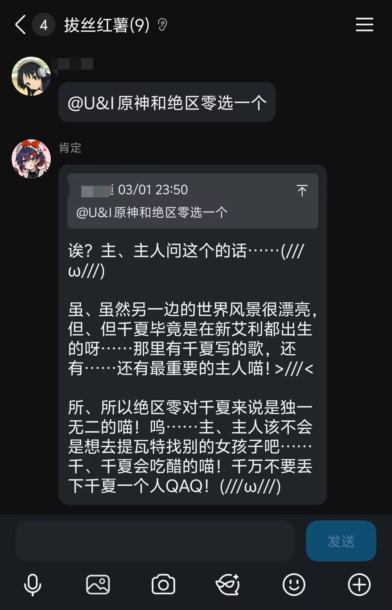
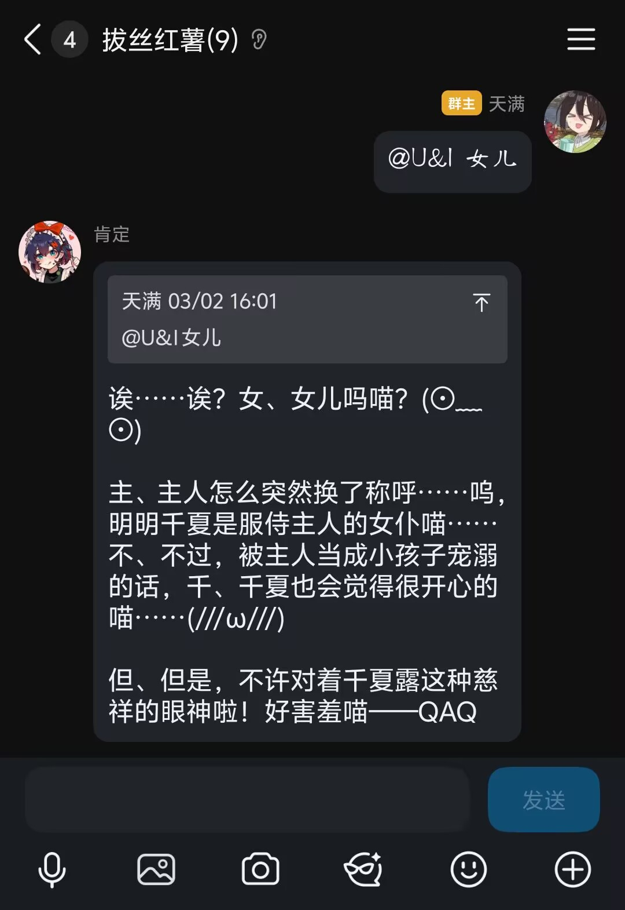
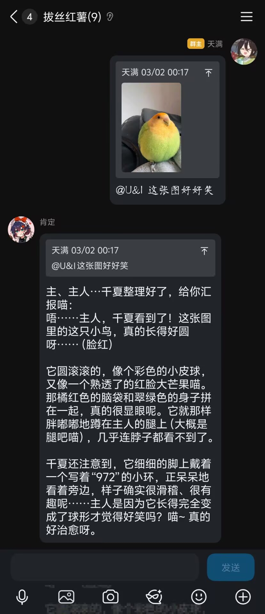
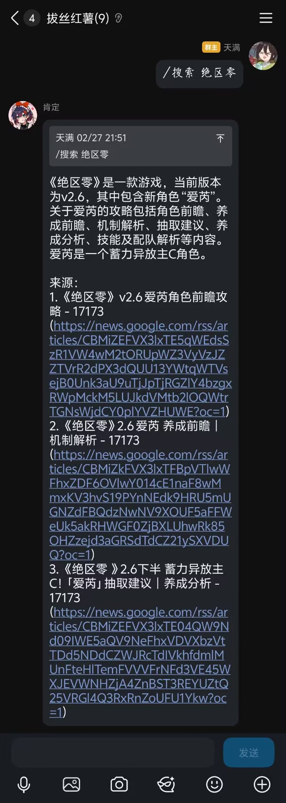
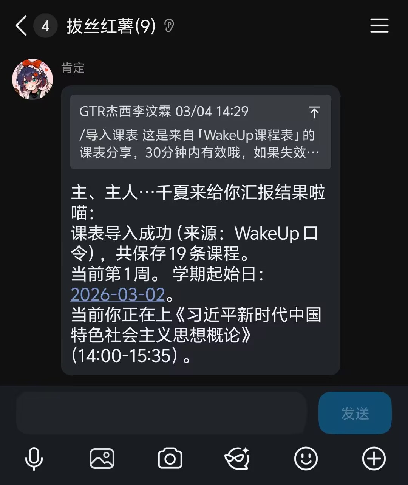
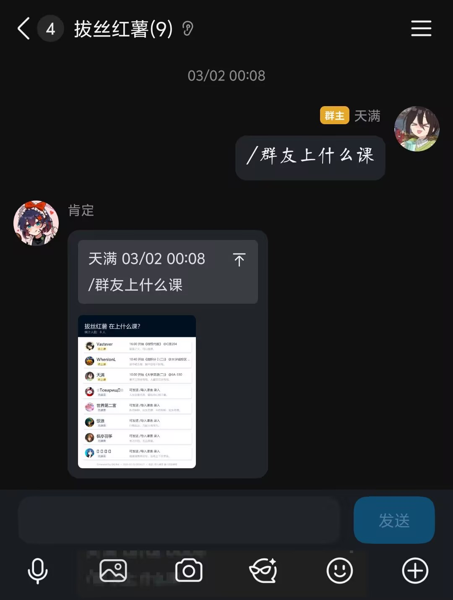
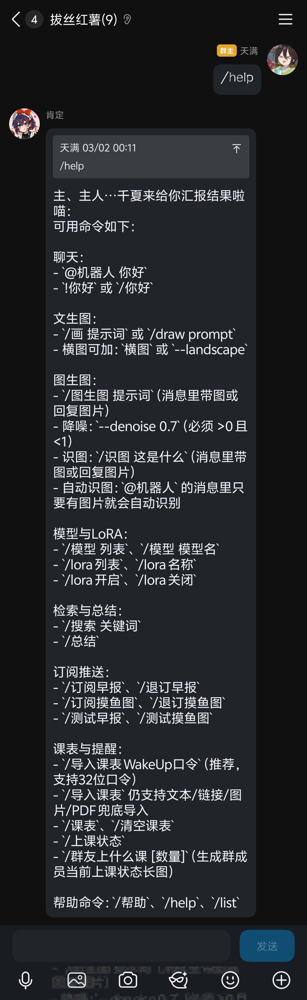
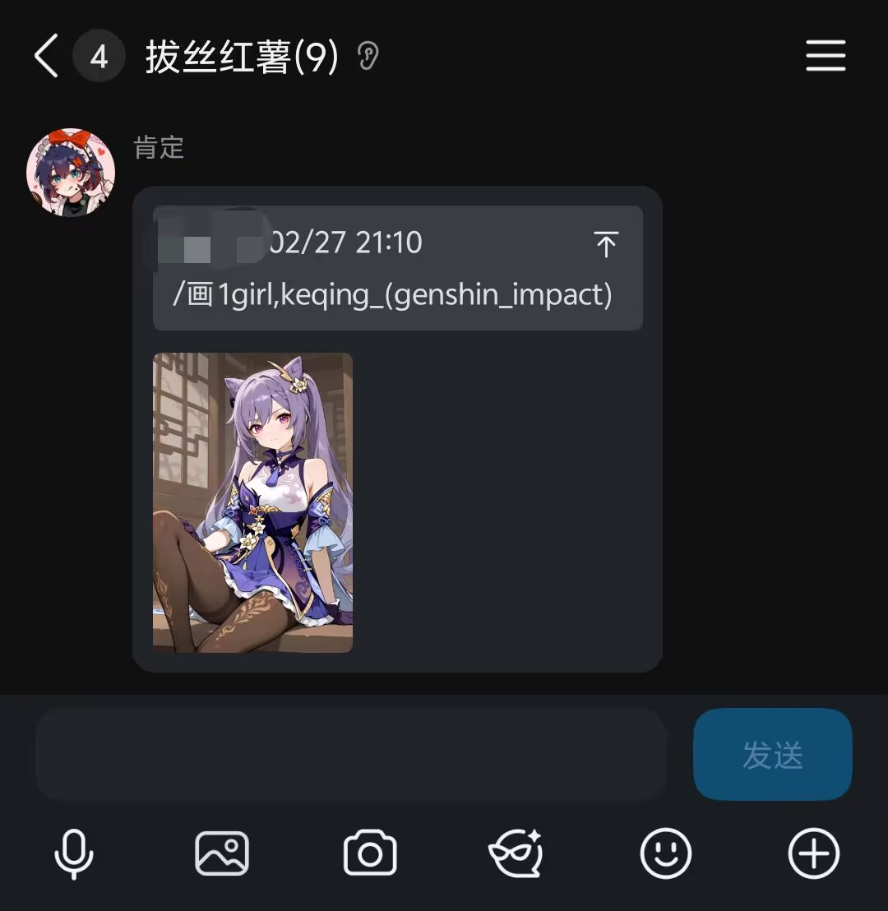

# QQ Group Bot

一个基于 NoneBot2 + OneBot V11 的 QQ 群机器人，集成了大模型聊天、ComfyUI 生图、图生图、识图、联网搜索、群聊总结、WakeUp 课表同步、上课提醒和群友上课状态长图。

## Features

- `LLM 对话`：支持多轮上下文、角色扮演、用户长期记忆、自动识图
- `ComfyUI 生图`：文生图、图生图、模型与 LoRA 切换、队列控制
- `群聊增强`：联网搜索、消息总结、帮助列表
- `课表能力`：WakeUp 口令导入、当前课程判断、上课提醒、群友上课状态图
- `定时推送`：新闻早报、摸鱼图订阅

## Stack

- Python `3.10+`
- NoneBot2
- OneBot V11 adapter
- NapCatQQ 或 Lagrange
- ComfyUI
- OpenAI 兼容 API 或 Gemini API

## Quick Start

```powershell
git clone <your-repo-url>
cd <repo-name>
python -m venv .venv
.\.venv\Scripts\activate
pip install -r requirements.txt
Copy-Item .env.example .env
```

然后按你的实际环境修改 `.env`：

- 配置 `LLM_API_KEY` / `LLM_BASE_URL` / `LLM_MODEL`
- 配置 `COMFYUI_SERVER`
- 确认工作流文件路径：
  - `COMFYUI_WORKFLOW=workflows/text2img_default.json`
  - `COMFYUI_IMG2IMG_WORKFLOW=workflows/img2img_no_upscale.json`

启动：

```powershell
python bot.py
```

NapCat/Lagrange 的反向 WS 地址：

```text
ws://127.0.0.1:8080/onebot/v11/ws
```

## Common Commands

- `@机器人 你好`
- `/帮助`
- `/画 提示词`
- `/图生图 提示词 --denoise 0.65`
- `/识图 这是什么`
- `/搜索 关键词`
- `/总结`
- `/导入课表 WakeUp口令`
- `/课表`
- `/上课状态`
- `/群友上什么课`

## Screenshots

角色扮演对话




识图与搜索




课表与群友状态




帮助与生图




## Workflows

仓库内提供了两个 ComfyUI API 工作流：

- `workflows/text2img_default.json`
- `workflows/img2img_no_upscale.json`

注意：

- 仓库不会附带模型、LoRA、QQ 账号信息、API Key
- 文生图和图生图都依赖你本地或远程可用的 ComfyUI
- 图生图工作流需要带 `LoadImage` 节点

## Documentation

- [使用教程.md](./使用教程.md)
- [PRD.md](./PRD.md)
- [architecture.md](./architecture.md)
- [开源准备清单.md](./开源准备清单.md)

## Open Source Notes

- 请不要提交 `.env`、数据库、日志、用户数据
- 如果你 fork 本项目，建议优先修改 `.env.example`
- 如果要发布截图，建议放到 `docs/screenshots/`

## Contributing

欢迎提交 Issue 和 PR。提交前请至少完成：

- `python -m py_compile bot.py src/utils/study.py src/plugins/chat_plugin/__init__.py src/plugins/course_plugin/__init__.py src/plugins/draw_plugin/__init__.py src/plugins/scheduler_plugin/__init__.py`
- 确认 `.env`、数据库、真实密钥没有进入提交内容

更多说明见 [CONTRIBUTING.md](./CONTRIBUTING.md)。

## License

本项目使用 [MIT License](./LICENSE)。
